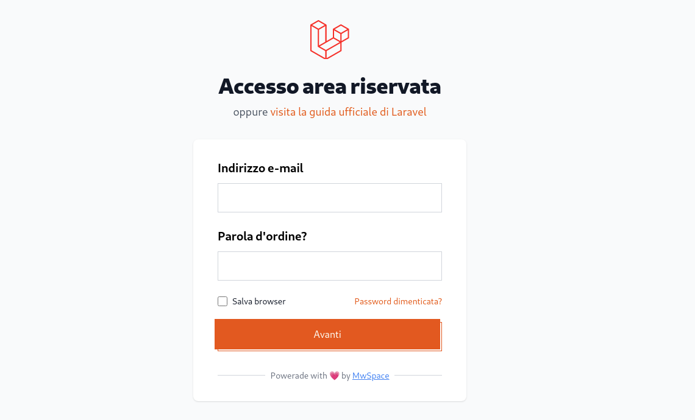

#  Admin

> Small cms system for your fantastic app with [Laravel](https://laravel.com/).

PHP Version  | Status  | Require  | version
------------ | ------- | -------- | -------
PHP >=7.0    | @Dev    | Laravel  | 1.0.0

> #### Install Library:

`composer require mwspace/admin`

This command install your admin in a fresh laravel application

> Get start with path: */admin*

## Contributing

Thank you for considering contributing to the MwSpace Company! The contribution can be found in
the [MwSpace Website](https://mwspace.com/it).

## Security Vulnerabilities

If you discover a security vulnerability within **mwspace/admin**, please send an e-mail to Dev team
via [dev@mwspace.com](mailto:dev@mwspace.com). All security vulnerabilities will be promptly addressed.

## License

The **mwspace/packlink-php** is application programming interface licensed under
the [Apache License 2.0](http://www.apache.org/licenses/LICENSE-2.0.txt).
